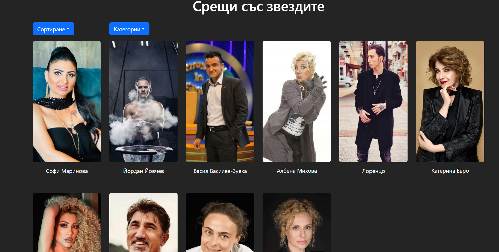

# Greet API Task

This is single-page application built with React and Bootstrap to consume and display products from the greet.bg API.

## Features

- Display product cards with images, names, categories, price and 'Arrange meeting' button.
- Load More button for loading more products.
- Filter products by category.
- Sort products by name and price.
- Active state on the buttons for sort and filter.

## Technologies Used

- React
- Bootstrap

## How to run the project

1. Clone this repository.
2. Install dependencies with 'npm install'.
3. Run the project with 'npm run dev' command.

## How to Use

1. Browse the products on the home page.
2. Use the filters and sorting options to refine your search.
3. CLick the 'Arrange meeting' button and get redirected to the cart page.
